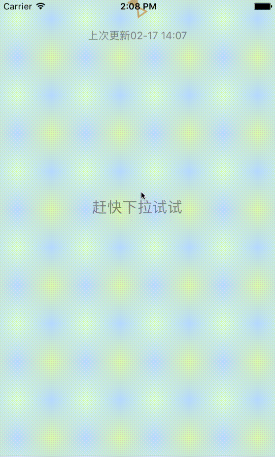
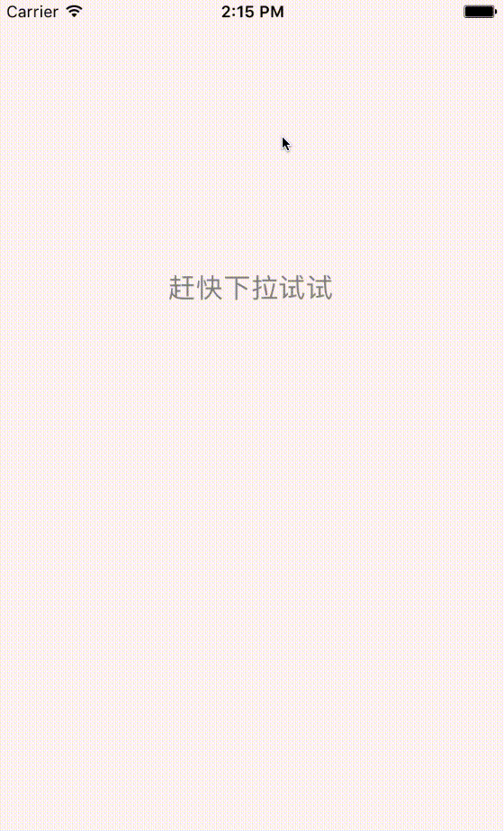

# BOOLRefreshController
Decoupled solution for DROP DOWN TO REFRESH 

# Check out the code, the demo tell you everything.
### Refresh control attach on the top of table view

### Refresh control fixed place at the bottom of navigation bar

